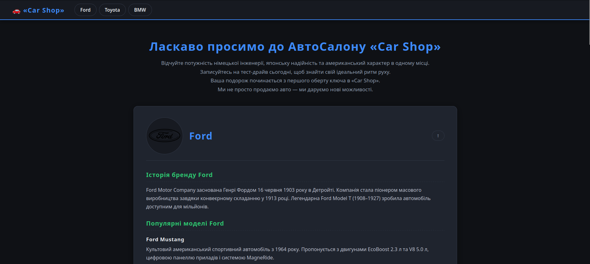
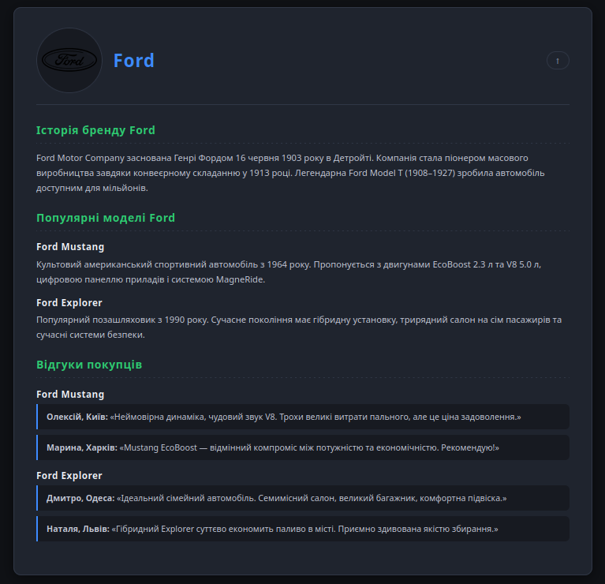
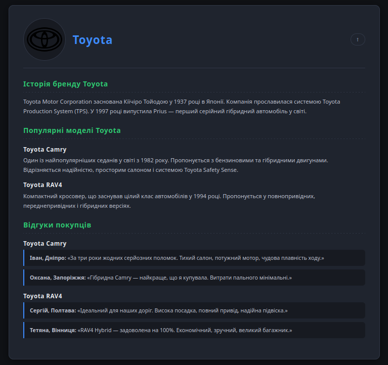
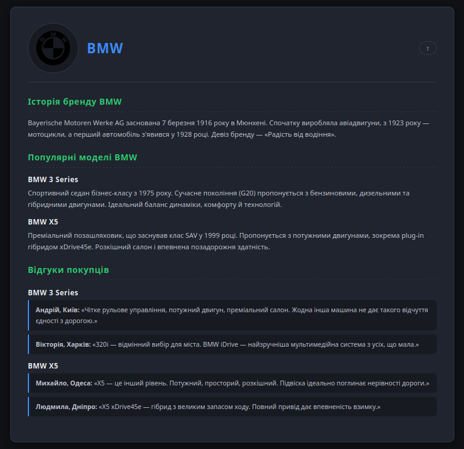

# 🚗 Car Shop — Автосалон

> **Веб-сайт автосалону з презентацією трьох легендарних автомобільних брендів: Ford, Toyota та BMW.**

---

## 📸 Скріншоти

### Головна сторінка


### Картки брендів
| Ford | Toyota | BMW |
|------|--------|-----|
|  |  |  |

### Футер із контактами


---

## 🌟 Про проєкт

**Car Shop** — це стильний односторінковий сайт-каталог автосалону, розроблений з нуля на чистому HTML та CSS. Без зайвих фреймворків, без зовнішніх залежностей — лише авторський код та увага до деталей.

Проєкт демонструє три культові автобренди: американський характер **Ford**, японську надійність **Toyota** та німецьку досконалість **BMW** — кожен у власній елегантній картці.

---

## ✨ Особливості

- 🌑 **Темна тема** — продумана кольорова палітра на основі CSS-змінних (`--bg`, `--surface`, `--card`), зручна для очей
- 📌 **Sticky-навігація** — шапка «прилипає» до верху при прокрутці, забезпечуючи миттєвий доступ до будь-якого бренду
- 🎨 **Дизайн-система** — всі кольори, відступи та ефекти централізовані у `:root`-змінних, що робить код легким для зміни
- 💬 **Відгуки покупців** — оформлені у стилі цитат із синьою акцентною полосою ліворуч
- 🏷️ **Семантичний HTML** — правильне використання `<article>`, `<section>`, `<header>`, `<footer>`, `<address>`, `<nav>`
- ⚡ **Плавні анімації** — картки «піднімаються» при наведенні завдяки CSS-переходам
- 📱 **Адаптивний футер** — контакти гнучко перебудовуються під будь-який розмір екрана через Flexbox

---

## 🗂️ Структура проєкту

```
car-shop/
│
├── index.html              # Головна HTML-сторінка
├── style.css               # Стилі з коментарями
│
├── icon/                   # Логотипи брендів
│   ├── icon-wheel-32.png
│   ├── icon-ford-100.png
│   ├── icon-toyota-100.png
│   └── icon-bmw-90.png
│
└── screenshots/            # Для скріншотів
    ├── preview-main.png
    ├── preview-ford.png
    ├── preview-toyota.png
    ├── preview-bmw.png
    └── preview-footer.png
```

---

## 🎨 Дизайн-система

Весь дизайн побудований на CSS-змінних — одне місце для управління зовнішнім виглядом:

| Змінна | Значення | Призначення |
|--------|--------|-----------|
| `--bg` | `rgb(15, 17, 21)` | Фон сторінки |
| `--surface` | `rgb(23, 26, 33)` | Шапка, футер, відгуки |
| `--card` | `rgb(31, 36, 46)` | Фон карток брендів |
| `--accent` | `rgb(61, 139, 255)` | Заголовки, кнопки, посилання |
| `--accent2` | `rgb(46, 204, 113)` | Заголовки секцій всередині карток |
| `--text` | `rgb(238, 241, 245)` | Основний текст |
| `--muted` | `rgb(148, 163, 184)` | Допоміжний текст |

**Шрифти:**
- [`Rajdhani`](https://fonts.google.com/specimen/Rajdhani) — заголовки (технічний, спортивний стиль)
- [`Nunito`](https://fonts.google.com/specimen/Nunito) — основний текст (м'який, читабельний)

---

## 🚘 Представлені бренди

<details>
<summary><strong>🔵 Ford — Американський характер</strong></summary>

- **Рік заснування:** 1903, Детройт
- **Піонер:** масового конвеєрного виробництва (1913)
- **Представлені моделі:**
  - **Ford Mustang** — культовий спортивний автомобіль з 1964 року (EcoBoost 2.3 л / V8 5.0 л)
  - **Ford Explorer** — сімейний позашляховик з гібридною установкою на 7 пасажирів

</details>

<details>
<summary><strong>🔴 Toyota — Японська надійність</strong></summary>

- **Рік заснування:** 1937, Японія
- **Легенда:** перший серійний гібрид у світі — Prius (1997)
- **Представлені моделі:**
  - **Toyota Camry** — один із найпопулярніших седанів у світі з 1982 року
  - **Toyota RAV4** — засновник класу компактних кросоверів (1994)

</details>

<details>
<summary><strong>⚫ BMW — Радість від водіння</strong></summary>

- **Рік заснування:** 1916, Мюнхен
- **Девіз:** «Freude am Fahren» — Радість від водіння
- **Представлені моделі:**
  - **BMW 3 Series (G20)** — еталон спортивного седана бізнес-класу з 1975 року
  - **BMW X5** — засновник класу преміальних SAV-позашляховиків (1999)

</details>

---

## 🛠️ Технічний стек


| Технологія | Використання |
|------------|-------------|
| **HTML5** | Семантична розмітка, структура документа |
| **CSS3** | Стилізація, анімації, адаптивність |
| **CSS Custom Properties** | Централізована дизайн-система |
| **Flexbox** | Навігація, картки, футер |
| **CSS Transitions** | Плавні ефекти при наведенні |
| **Sticky Positioning** | «Прилипаюча» шапка |

---

## 🚀 Як запустити

```bash
# Клонувати репозиторій
git clone https://github.com/your-username/car-shop.git

# Перейти в папку
cd car-shop

# Відкрити в браузері
# Просто відкрий index.html у будь-якому браузері
# або запусти через Live Server у VS Code
```

> Проєкт не потребує жодних залежностей, збірників чи серверів — відкрий `index.html` і готово! 🎉

---

**Зроблено з ❤️ та увагою до кожної деталі**

*Від кольорової палітри до семантичної розмітки — кожен рядок коду написаний вручну.*

</div>
